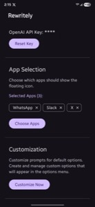

# Rewritely - Android App for Text Rewriting

Rewritely is an Android application that enhances user input by providing an easy way to rewrite text in any input field. It uses the OpenAI API to generate rewritten text and displays a floating icon for quick access.

## Screenshots

<div align="center">
  
  
</div>

*Left: Settings screen showing API key management, app selection, and customization options*  
*Right: Text input screen with the floating rewrite icon visible*

## Features

* **Text Rewriting:** Rewrites text in any input field using the OpenAI API.
* **Floating Icon:** Provides a non-intrusive floating icon for easy access to the rewrite functionality. Type at least 3 words in the input field for the icon to show up.
* **API Key Management:** Securely stores and manages the OpenAI API key with the ability to reset it.
* **App Selection:** Choose which specific apps should show the floating icon, or enable it for all apps.
* **Custom Options:** Create and manage custom rewrite prompts with up to 4 custom options plus default and ChatGPT options.
* **Smart Caching:** Efficient app list caching for better performance during app selection.
* **Permissions Handling:** Manages necessary permissions, including Accessibility Service and Draw Over Other Apps.

## Prerequisites

* Android device with API level 23 or higher.
* OpenAI API Key.

## Setup

1.  **Clone the repository:**
    ```bash
    git clone <repository_url>
    ```
2.  **Open the project** in Android Studio.
3.  **Obtain an OpenAI API Key** from the OpenAI platform.
4.  **Build and run** the app on an Android device or emulator.
5.  **Enter your OpenAI API key** in the app's settings.
6.  **Grant the necessary permissions**, specifically:
    * **Accessibility Service:** Enable the Rewritely Accessibility Service to allow the app to monitor and interact with text fields.
    * **Draw Over Other Apps:** Allow the app to display the floating icon.

## Usage

### Basic Text Rewriting
1. Open any app with text input fields
2. Type at least 3 words in a text field
3. A floating icon will appear next to the text field
4. Tap the floating icon to rewrite your text using AI

### App Selection
1. Go to the app's settings screen
2. Tap "Choose Apps" in the App Selection section
3. Select which apps should show the floating icon
4. You can choose specific apps or enable it for all apps

### Custom Options
1. In the settings screen, tap "Customize Now" in the Customization section
2. Create custom rewrite prompts with descriptive names
3. Edit the default and ChatGPT options as needed
4. Up to 4 custom options can be created in addition to the built-in options

## Architecture

The app follows a simple architecture with the following key components:

* **MainActivity:** The main activity handles the UI for API key input, permission requests, and settings management.
* **RewritelyService:** An Accessibility Service that monitors text fields, displays the floating icon, and handles the text rewriting.
* **OpenAiApiService:** A Retrofit interface for making API calls to the OpenAI API.
* **ApiClient:** A singleton object that provides a Retrofit client for the OpenAI API.
* **SecurePrefs:** A utility class for securely storing the OpenAI API key and custom options using EncryptedSharedPreferences.
* **AppSelectionSettings:** Manages which apps should show the floating icon.
* **CustomOption:** Data class for managing custom rewrite prompts.
* **AppCache:** Handles caching of installed apps for better performance.

## Dependencies

* Kotlin
* AndroidX libraries
* Retrofit
* OkHttp
* AndroidX Security Crypto
* Jetpack Compose

## Permissions

The app requires the following permissions:

* **android.permission.SYSTEM_ALERT_WINDOW:** To draw the floating icon over other apps.
* **android.permission.INTERNET:** To communicate with the OpenAI API.
* **android.permission.FOREGROUND_SERVICE:** To keep the service running in the background.
* **android.permission.FOREGROUND_SERVICE_SPECIAL_USE:** (Android 14+)  Specific foreground service permission.
* **android.permission.BIND_ACCESSIBILITY_SERVICE:** Granted by the system when the user enables the Accessibility Service.

## Important Notes

* The OpenAI API key is stored securely using EncryptedSharedPreferences.
* The Accessibility Service is crucial for the app's functionality. The app will not function correctly without it enabled.
* The app uses `foregroundServiceType="specialUse"` and the corresponding permission for Android 14 to provide a clear justification for its background operation, emphasizing its assistance features.
* Custom options are limited to 4 additional options plus the default and ChatGPT options.
* App selection settings are saved automatically and persist across app restarts.

## Contributing

Contributions are welcome! Please feel free to submit pull requests or open issues.

## License

Apache 2.0 License
